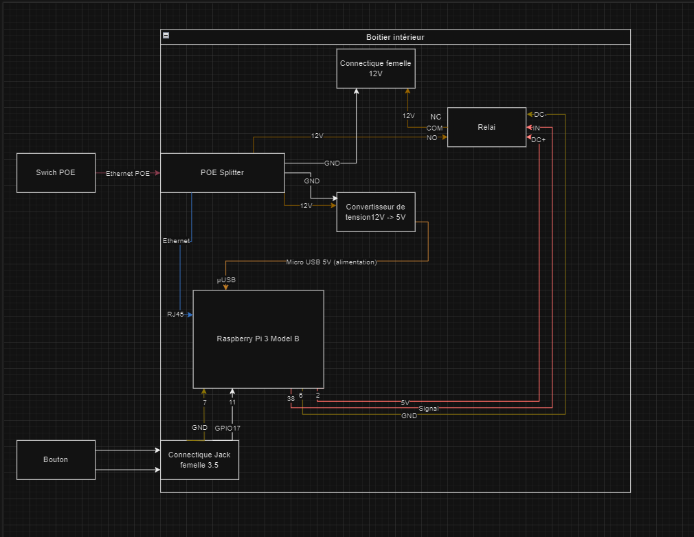
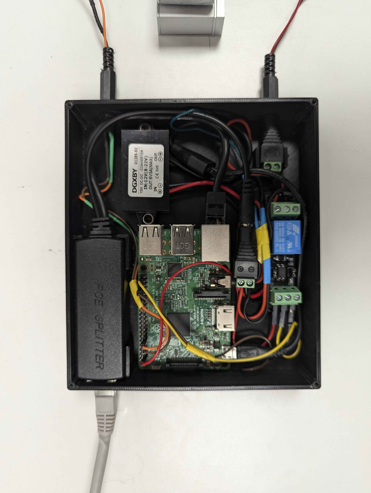

# IOT Smart Lock Management System


## 🔐 Overview

The **IOT Smart Lock Management System** is a comprehensive solution for managing smart locks in industrial environments. This system provides centralized control and monitoring of multiple smart locks through a web-based interface, with hardware integration using ESP32 and Raspberry Pi.

## 🏗️ Architecture

The system consists of three main components:

### 📱 Frontend (Angular)
- **Technology**: Angular 18 with Angular Material
- **Features**: User management, door management, access control, activity logs
- **Authentication**: JWT-based authentication with Keycloak integration

### 🖥️ Backend (ASP.NET Core)
- **Technology**: .NET 8.0 with ASP.NET Core Web API
- **Database**: Supabase (PostgreSQL)
- **Authentication**: JWT Bearer tokens
- **Features**: RESTful API, real-time logging, user & door management

### 🔧 Hardware
- **ESP32**: RFID card reading with Bluetooth Low Energy (BLE) communication
- **Raspberry Pi**: GPIO control for physical lock mechanisms
- **Communication**: BLE between ESP32 and control system

## 📸 System Screenshots

### User Management

*Create and manage users with role-based access*


*Organize users into groups for efficient permission management*


*Edit user information and permissions*

### Door Access Control

*Manage multiple doors and their access permissions*


*Assign user groups to specific doors*

### Activity Monitoring

*Monitor all access attempts and system activities in real-time*

## 🔧 Hardware Architecture

### System Diagram

*Basic hardware connection overview*


*Detailed hardware component integration*

### Physical Implementation

*ESP32 and RFID reader setup*


*Complete hardware assembly*


*Raspberry Pi integration with control circuits*

## 🚀 Quick Start

### Prerequisites
- Node.js 18+ (for frontend)
- .NET 8.0 SDK (for backend)
- Supabase account
- Hardware: ESP32, Raspberry Pi, MFRC522 RFID reader

### Installation

1. **Clone the repository**
   ```bash
   git clone <repository-url>
   cd IOT-Smart-Lock-Management
   ```

2. **Setup Backend**
   ```bash
   cd backend
   # Configure environment variables in Properties/launchSettings.json
   dotnet restore
   dotnet run
   ```

3. **Setup Frontend**
   ```bash
   cd frontend
   npm install
   ng serve --configuration development
   ```

4. **Setup Hardware**
   ```bash
   cd hardware/src
   # Upload main.c to ESP32
   # Run rasbperry.py on Raspberry Pi
   python3 rasbperry.py
   ```

### Configuration

#### Backend Environment Variables
```json
{
  "SUPABASE_URL": "https://your-supabase-url.supabase.co",
  "SUPABASE_SERVICE_KEY": "your-service-key",
  "AUTH_JWT_KEY_ISSUER": "https://your-supabase-url.supabase.co/auth/v1",
  "AUTH_JWT_KEY": "your-jwt-secret-key",
  "AUTH_ENABLED": "true"
}
```

## 📚 Component Documentation

- **[Frontend Documentation](frontend/README.md)** - Angular application setup and development
- **[Backend Documentation](backend/README.md)** - API documentation and configuration
- **[Hardware Documentation](hardware/README.md)** - Hardware setup and programming guide

## 🔑 Key Features

### Access Management
- **User Management**: Create, update, and delete users
- **Group Management**: Organize users into groups
- **Door Management**: Configure and manage multiple doors
- **Permission Control**: Assign access rights to users and groups

### Security
- **RFID Authentication**: Physical card-based access
- **JWT Tokens**: Secure API authentication
- **Activity Logging**: Comprehensive audit trail
- **Role-Based Access**: Admin and user role separation

### Real-time Monitoring
- **Live Activity Feed**: Real-time access attempt monitoring
- **System Status**: Hardware connectivity and health monitoring
- **Alert System**: Unauthorized access notifications

## 📄 API Documentation

The backend provides a comprehensive REST API with the following main endpoints:

- **Users**: `/admin/user/*` - User management operations
- **User Groups**: `/admin/usergroup/*` - User group operations
- **Doors**: `/admin/door/*` - Door management operations
- **Door Groups**: `/admin/doorgroup/*` - Door group operations
- **Logs**: `/logs/*` - Activity logging and retrieval

For detailed API documentation, run the backend and visit `/swagger` for interactive API documentation.

## 🤝 Contributing

1. Fork the repository
2. Create a feature branch (`git checkout -b feature/amazing-feature`)
3. Commit your changes (`git commit -m 'Add amazing feature'`)
4. Push to the branch (`git push origin feature/amazing-feature`)
5. Open a Pull Request

## 📄 License

This project is licensed under the MIT License - see the [LICENSE](LICENSE) file for details.

## 👥 Team

- **Project Type**: Industrial IoT Solution
- **Technologies**: Angular, .NET Core, ESP32, Raspberry Pi
- **Database**: Supabase (PostgreSQL)
- **Hardware Communication**: Bluetooth Low Energy (BLE)

## 📞 Support

For support and questions:
- Create an issue in the repository
- Check the component-specific README files
- Review the API documentation at `/swagger`

---

**Note**: This system is designed for industrial environments and requires proper security configuration before deployment in production. 