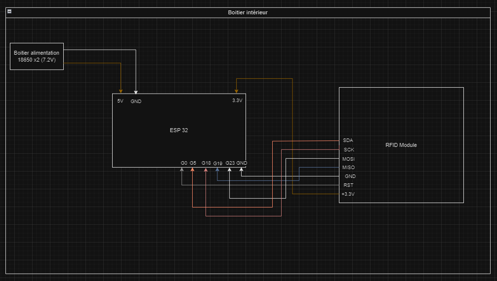
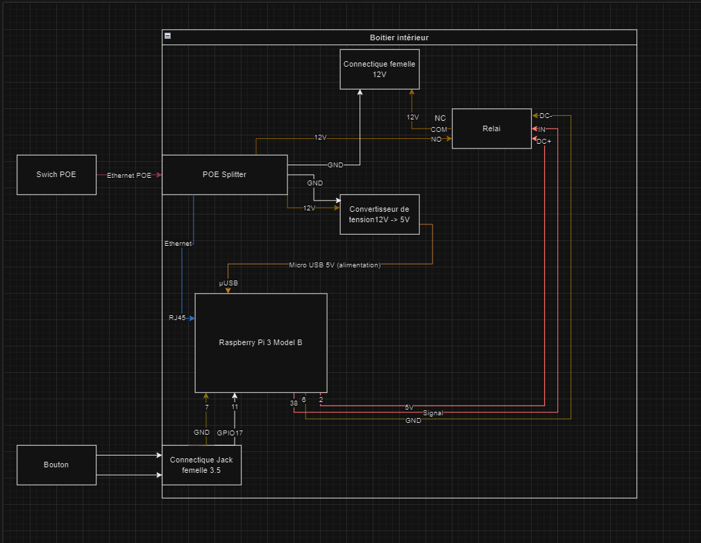
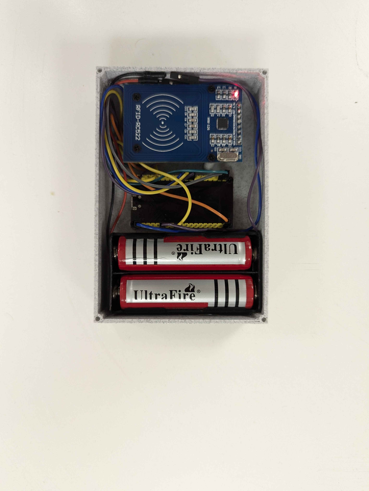
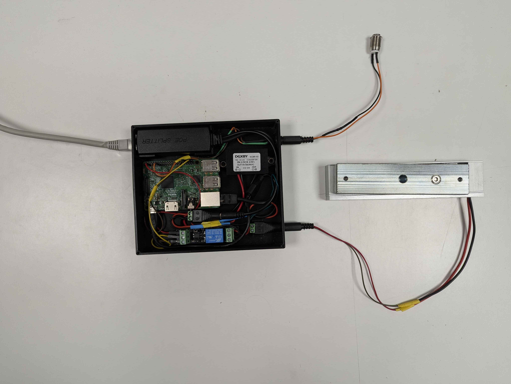
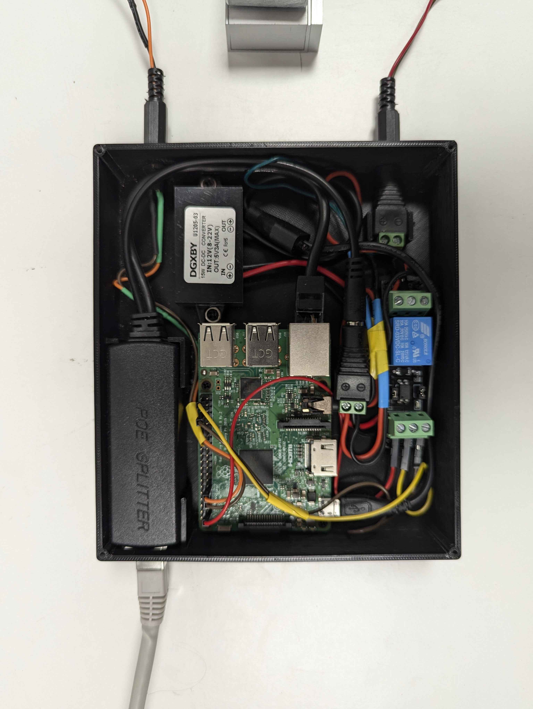

# Hardware - IOT Smart Lock System

## 🔧 Overview

The **Hardware Component** of the IOT Smart Lock Management System consists of integrated ESP32 and Raspberry Pi modules that provide RFID card reading, Bluetooth communication, and physical lock control. This distributed architecture ensures reliable access control with real-time monitoring capabilities.

## 🏗️ System Architecture

### Hardware Components
- **ESP32 DevKit**: Main microcontroller with WiFi/Bluetooth capabilities
- **Raspberry Pi**: GPIO control unit for lock mechanisms
- **MFRC522 RFID Reader**: 13.56MHz contactless card reader
- **Relay Module**: Physical lock actuator control
- **Power Supply**: 5V/3.3V power distribution
- **Connecting Wires**: Dupont wires for prototyping

### Communication Flow
```
RFID Card → ESP32 → BLE → Control System → Raspberry Pi → Lock Mechanism
                      ↓
                 Supabase Database ← Backend API
```

## 📸 Hardware Setup

### System Architecture Diagrams

*Basic system overview showing component connections*


*Detailed component integration and communication flow*

### Physical Implementation

*ESP32 with MFRC522 RFID reader module*


*Complete prototyping setup with breadboard connections*


*Raspberry Pi integration with relay control circuits*

## 🔌 Component Specifications

### ESP32 DevKit
- **Microcontroller**: Xtensa dual-core 32-bit LX6
- **WiFi**: 802.11 b/g/n
- **Bluetooth**: v4.2 BR/EDR and BLE
- **GPIO Pins**: 30 digital I/O pins
- **Operating Voltage**: 3.3V
- **Flash Memory**: 4MB

### MFRC522 RFID Module
- **Operating Frequency**: 13.56 MHz
- **Communication**: SPI protocol
- **Reading Distance**: 0-60mm
- **Supported Cards**: MIFARE Classic, NTAG, ISO14443A
- **Operating Voltage**: 3.3V
- **Current Consumption**: 13-100mA

### Raspberry Pi (GPIO Control)
- **Model**: Raspberry Pi 3B+ or 4
- **GPIO Pins**: 40-pin header
- **Operating System**: Raspberry Pi OS
- **Python Version**: 3.7+
- **Power**: 5V via USB-C or GPIO

## 📐 Wiring Diagrams

### ESP32 to MFRC522 Connections
```
ESP32 Pin    →    MFRC522 Pin
3.3V         →    3.3V
GND          →    GND
GPIO 5       →    SS (SDA)
GPIO 23      →    MOSI
GPIO 19      →    MISO
GPIO 18      →    SCK
GPIO 2       →    RST (optional)
```

### Raspberry Pi GPIO Configuration
```
GPIO Pin     →    Function
GPIO 7       →    Input Button 1
GPIO 11      →    Input Button 2
GPIO 38      →    Relay Control Output
5V           →    Relay Module Power
GND          →    Common Ground
```

## 💻 Software Components

### ESP32 Firmware (`main.c`)

#### Key Features
- **RFID Card Reading**: Continuous scanning for cards
- **BLE Communication**: Broadcasts card data to control system
- **Low Power Mode**: Sleep mode between card reads
- **Error Handling**: Robust error detection and recovery

#### Main Functions
```c
void setup() {
    // Initialize serial communication
    Serial.begin(115200);
    
    // Initialize BLE with device name "RFID-ESP32"
    BLEDevice::init("RFID-ESP32");
    
    // Create BLE server and characteristics
    pServer = BLEDevice::createServer();
    
    // Initialize MFRC522 RFID reader
    mfrc522.PCD_Init();
}

void loop() {
    // Check for new RFID cards
    if (mfrc522.PICC_IsNewCardPresent() && mfrc522.PICC_ReadCardSerial()) {
        // Read UID and send via BLE
        sendCardData();
    }
}
```

#### BLE Service Configuration
- **Service UUID**: `4fafc201-1fb5-459e-8fcc-c5c9c331914b`
- **Characteristic UUID**: `beb5483e-36e1-4688-b7f5-ea07361b26a8`
- **Properties**: READ, NOTIFY
- **Data Format**: Raw UID bytes

### Raspberry Pi Controller (`rasbperry.py`)

#### Key Features
- **GPIO Input Monitoring**: Button press detection
- **Relay Control**: Physical lock actuation
- **Event-driven Architecture**: Interrupt-based input handling
- **Debounce Protection**: Prevents false triggers

#### Main Functions
```python
import RPi.GPIO as GPIO
import time

# GPIO configuration
GPIO.setmode(GPIO.BOARD)
GPIO.setup(7, GPIO.IN)      # Button 1 input
GPIO.setup(11, GPIO.IN)     # Button 2 input
GPIO.setup(38, GPIO.OUT)    # Relay output

def button_callback1(channel):
    """Handle button 1 press - activate lock"""
    GPIO.output(38, GPIO.HIGH)
    time.sleep(2)  # Keep lock active for 2 seconds
    GPIO.output(38, GPIO.LOW)

def button_callback2(channel):
    """Handle button 2 press - activate lock"""
    GPIO.output(38, GPIO.HIGH)
    time.sleep(2)
    GPIO.output(38, GPIO.LOW)

# Event detection with debounce
GPIO.add_event_detect(7, GPIO.FALLING, callback=button_callback1, bouncetime=150)
GPIO.add_event_detect(11, GPIO.FALLING, callback=button_callback2, bouncetime=150)
```

## 🚀 Setup Instructions

### ESP32 Development Environment

#### Prerequisites
- **Arduino IDE** 2.0+ or **PlatformIO**
- **ESP32 Board Package** for Arduino IDE
- **Required Libraries**:
  - ESP32 BLE Arduino
  - MFRC522v2

#### Installation Steps

1. **Install Arduino IDE**
   ```bash
   # Download from https://www.arduino.cc/en/software
   # Or install via package manager
   sudo apt-get install arduino  # Ubuntu/Debian
   brew install arduino-cli      # macOS
   ```

2. **Add ESP32 Board Support**
   - Open Arduino IDE
   - Go to File → Preferences
   - Add ESP32 board manager URL:
     ```
     https://dl.espressif.com/dl/package_esp32_index.json
     ```
   - Install ESP32 by Espressif Systems

3. **Install Required Libraries**
   - Library Manager → Search and install:
     - "ESP32 BLE Arduino" by Neil Kolban
     - "MFRC522v2" by OSSLibraries

4. **Upload Firmware**
   ```bash
   # Connect ESP32 via USB
   # Select Board: ESP32 Dev Module
   # Select Port: /dev/ttyUSB0 (Linux) or COM port (Windows)
   # Upload the main.c code
   ```

### Raspberry Pi Setup

#### Prerequisites
- **Raspberry Pi OS** (Bullseye or newer)
- **Python 3.7+**
- **RPi.GPIO Library**

#### Installation Steps

1. **Update System**
   ```bash
   sudo apt update && sudo apt upgrade -y
   ```

2. **Install Python Dependencies**
   ```bash
   sudo apt install python3-pip python3-rpi.gpio
   pip3 install RPi.GPIO
   ```

3. **Enable GPIO**
   ```bash
   # Add user to gpio group
   sudo usermod -a -G gpio $USER
   
   # Enable GPIO in config
   echo "dtparam=gpio=on" | sudo tee -a /boot/config.txt
   ```

4. **Setup Auto-start Service**
   ```bash
   # Create systemd service
   sudo nano /etc/systemd/system/smartlock.service
   ```
   
   Service file content:
   ```ini
   [Unit]
   Description=Smart Lock GPIO Controller
   After=network.target
   
   [Service]
   Type=simple
   User=pi
   WorkingDirectory=/home/pi/IOT-Smart-Lock-Management/hardware/src
   ExecStart=/usr/bin/python3 rasbperry.py
   Restart=always
   
   [Install]
   WantedBy=multi-user.target
   ```
   
   Enable service:
   ```bash
   sudo systemctl enable smartlock.service
   sudo systemctl start smartlock.service
   ```

## 🔧 Configuration & Calibration

### RFID Reader Calibration
```c
// Adjust antenna gain for optimal reading distance
mfrc522.PCD_SetAntennaGain(mfrc522.RxGain_max);

// Set timeout for card detection
mfrc522.PCD_SetTimeout(50);  // 50ms timeout
```

### BLE Configuration
```c
// Configure advertising parameters
BLEAdvertising *pAdvertising = pServer->getAdvertising();
pAdvertising->setMinInterval(100);  // 100ms minimum interval
pAdvertising->setMaxInterval(200);  // 200ms maximum interval
pAdvertising->start();
```

### GPIO Timing Adjustment
```python
# Adjust relay activation time based on lock mechanism
LOCK_ACTIVATION_TIME = 2.0  # seconds

# Adjust debounce time for button responsiveness
DEBOUNCE_TIME = 150  # milliseconds
```

## 🔒 Security Considerations

### Data Protection
- **UID Encryption**: Consider encrypting RFID UID data
- **BLE Security**: Implement pairing and encryption
- **Physical Security**: Protect hardware from tampering

### Access Control
- **Card Cloning Prevention**: Use encrypted cards when possible
- **Range Limitation**: Adjust RFID reader sensitivity
- **Audit Logging**: Log all access attempts

## 🐛 Troubleshooting

### Common ESP32 Issues

1. **RFID Reader Not Detected**
   ```c
   // Add diagnostic code
   if (!mfrc522.PCD_PerformSelfTest()) {
       Serial.println("RFID reader self-test failed");
   }
   ```

2. **BLE Connection Problems**
   ```c
   // Reset BLE stack
   esp_bt_controller_disable();
   esp_bt_controller_enable(ESP_BT_MODE_BLE);
   ```

3. **Power Issues**
   - Use quality USB cables
   - Check 3.3V power supply stability
   - Add decoupling capacitors

### Common Raspberry Pi Issues

1. **GPIO Permission Errors**
   ```bash
   # Check GPIO group membership
   groups $USER
   
   # Add user to gpio group if missing
   sudo usermod -a -G gpio $USER
   ```

2. **Service Startup Issues**
   ```bash
   # Check service status
   sudo systemctl status smartlock.service
   
   # View logs
   journalctl -u smartlock.service -f
   ```

3. **GPIO State Issues**
   ```python
   # Add cleanup in exception handling
   try:
       # Main loop
       pass
   except KeyboardInterrupt:
       GPIO.cleanup()
   ```

## 🧪 Testing & Validation

### Hardware Testing

#### RFID Functionality Test
```c
void testRFID() {
    Serial.println("Testing RFID reader...");
    if (mfrc522.PCD_PerformSelfTest()) {
        Serial.println("RFID test PASSED");
    } else {
        Serial.println("RFID test FAILED");
    }
}
```

#### BLE Communication Test
```c
void testBLE() {
    // Send test data via BLE
    String testData = "TEST_CARD_123456";
    pCharacteristic->setValue(testData.c_str());
    pCharacteristic->notify();
}
```

#### GPIO Test Script
```python
#!/usr/bin/env python3
# Test GPIO functionality
import RPi.GPIO as GPIO
import time

def test_gpio():
    GPIO.setmode(GPIO.BOARD)
    GPIO.setup(38, GPIO.OUT)
    
    print("Testing relay activation...")
    GPIO.output(38, GPIO.HIGH)
    time.sleep(1)
    GPIO.output(38, GPIO.LOW)
    print("Test complete")
    
    GPIO.cleanup()

if __name__ == "__main__":
    test_gpio()
```

### Integration Testing
1. **End-to-End Test**: RFID card → ESP32 → BLE → System → Raspberry Pi → Lock
2. **Range Testing**: Verify RFID reading distance and BLE communication range
3. **Performance Testing**: Measure response times and power consumption
4. **Reliability Testing**: Extended operation testing

## 📦 Parts List & Cost

### Required Components
| Component | Quantity | Estimated Cost |
|-----------|----------|----------------|
| ESP32 DevKit | 1 | $8-12 |
| Raspberry Pi 4B | 1 | $35-55 |
| MFRC522 RFID Module | 1 | $5-8 |
| Relay Module (5V) | 1 | $3-5 |
| Breadboard | 1 | $3-5 |
| Dupont Wires | 1 set | $5-10 |
| Power Supplies | 2 | $10-15 |
| MicroSD Card (32GB) | 1 | $8-12 |
| **Total Estimated Cost** | | **$77-122** |

### Optional Components
- Enclosure/Housing: $10-25
- PCB for permanent installation: $15-30
- Professional RFID cards: $1-3 each
- Lock mechanism: $20-100 (depending on type)

## 🔄 Maintenance & Updates

### Firmware Updates
```bash
# Update ESP32 firmware via Arduino IDE
# Or use OTA (Over-The-Air) updates for remote deployment
```

### System Monitoring
```python
# Add system health monitoring
import psutil

def check_system_health():
    cpu_temp = psutil.sensors_temperatures()
    memory_usage = psutil.virtual_memory()
    
    # Log system status
    print(f"CPU Temperature: {cpu_temp}")
    print(f"Memory Usage: {memory_usage.percent}%")
```

## 📚 Resources & Documentation

### Technical Documentation
- **ESP32 Datasheet**: https://www.espressif.com/sites/default/files/documentation/esp32_datasheet_en.pdf
- **MFRC522 Datasheet**: https://www.nxp.com/docs/en/data-sheet/MFRC522.pdf
- **Raspberry Pi GPIO Guide**: https://pinout.xyz/

### Development Resources
- **ESP32 Arduino Core**: https://github.com/espressif/arduino-esp32
- **MFRC522 Library**: https://github.com/OSSLibraries/Arduino_MFRC522v2
- **RPi.GPIO Documentation**: https://pypi.org/project/RPi.GPIO/

### Community Support
- **ESP32 Forum**: https://esp32.com/
- **Raspberry Pi Forums**: https://forums.raspberrypi.org/
- **Arduino Community**: https://forum.arduino.cc/

---

**⚠️ Safety Notice**: Always follow proper electrical safety procedures when working with hardware. Ensure proper power ratings and use appropriate protection circuits for relay-controlled devices. 